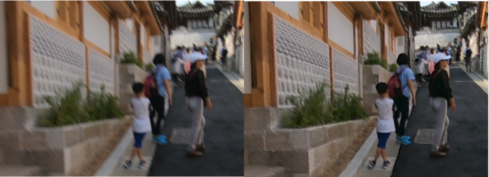

# attention-video-super-resolution
This repository contains a deep learning model that achieves video super-resolution tasks by leveraging cross-attention and dynamic filtering. The model predicts each frame by taking into account not only the low resolution itself but also its neighboring frames. In order to capture the dependencies among nearby frames, the models use Vision Transformers.

 

  
  <h3> Comparison between the original video (bottom) and the predicted video (top). </h3>
  

  
  <h3> Single frame difference </h3>

 

 Additionally, the entire network is designed to be scalable, enabling customization based on the number of neighbors and features used, so as to handle the performance-inference time tradeoff.
 
## Architecture
The architecture aims to predict the residual that enhances image sharpness. The network consists of three principal blocks:
- The **Feature Extractor** is a series of convolutional layers that extract the desired number of features from the input.
- The **Align Module** uses pyramidal frame representation to learn offsets for deformable convolutions, generating upsampled aligned features.
- The **Spatiotemporal** Attention Layer fuses features through correlation computation and convolution. It then applies spatial attention with pooling and multiplies it with frame-wise features.
- The actual residual is computed by another convolutional stage and added to the original upsampled image.

--------------- TODO: foto architettura ---------------

## Results 

## Installation

## Usage

## Contributing
Contributions are welcome! If you find any issues or have suggestions for improvements, please open an issue or submit a pull request.

## License
This project is licensed under the MIT License.

## Acknowledgment
